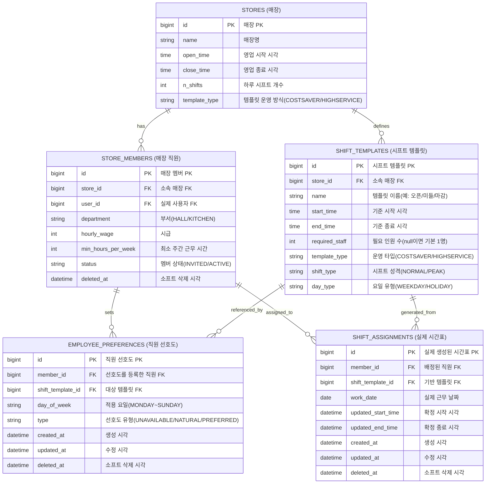

# ShiftMate Shift Planning ERD

직원 선호도, 가게 시프트 템플릿, 실제 시간표 생성에 필요한 테이블만 다시 정리한 문서입니다.

- 기준 소스
  - `src/main/java/com/example/shiftmate/domain/employeePreference/entity/EmployeePreference.java`
  - `src/main/java/com/example/shiftmate/domain/shiftTemplate/entity/ShiftTemplate.java`
  - `src/main/java/com/example/shiftmate/domain/shiftAssignment/entity/ShiftAssignment.java`
  - `src/main/java/com/example/shiftmate/domain/store/entity/Store.java`
  - `src/main/java/com/example/shiftmate/domain/storeMember/entity/StoreMember.java`
- 컬럼명 전제: Spring Boot 기본 snake_case 네이밍 전략 기준

## 핵심 ERD

## 관계 해석

- `stores` 1 : N `shift_templates`
  - 한 매장은 여러 시프트 템플릿을 가질 수 있습니다.
- `stores` 1 : N `store_members`
  - 한 매장에는 여러 직원이 소속됩니다.
- `store_members` 1 : N `employee_preferences`
  - 한 직원은 여러 템플릿/요일 조합에 대해 선호도를 등록할 수 있습니다.
- `shift_templates` 1 : N `employee_preferences`
  - 하나의 템플릿에 대해 여러 직원이 선호도를 가질 수 있습니다.
- `store_members` 1 : N `shift_assignments`
  - 한 직원은 여러 실제 근무 배정을 가질 수 있습니다.
- `shift_templates` 1 : N `shift_assignments`
  - 실제 배정은 특정 템플릿을 기반으로 생성됩니다.

## 시간표 생성 로직 기준 메모

`ShiftAssignmentService.createSchedule()` 기준으로 보면 실제 시간표 생성은 아래 규칙을 따릅니다.

1. 생성 권한은 해당 매장의 `MANAGER` 만 가집니다.
2. 시작일은 반드시 월요일이어야 합니다.
3. 매장에 템플릿이 하나 이상 있어야 합니다.
4. 선호도는 `UNAVAILABLE` 을 제외한 데이터만 후보로 사용합니다.
5. 배정 가능한 직원은 `deleted_at IS NULL` 이고 `status` 가 `ACTIVE` 인 멤버입니다.
6. `required_staff` 가 비어 있으면 템플릿당 기본 1명을 배정 대상으로 봅니다.
7. 먼저 `min_hours_per_week` 가 부족한 직원부터 우선 배정합니다.
8. 같은 조건이면 `PREFERRED` 가 `NATURAL` 보다 우선합니다.
9. 같은 날짜에 기존 배정 시간과 겹치면 중복 배정하지 않습니다.
10. 실제 생성 결과는 `shift_assignments` 에 저장됩니다.

## 참고

- 전체 도메인 분리 ERD: [shiftmate-domain-erd.md](./shiftmate-domain-erd.md)
- 전체 상세 ERD: [shiftmate-erd.md](./shiftmate-erd.md)
