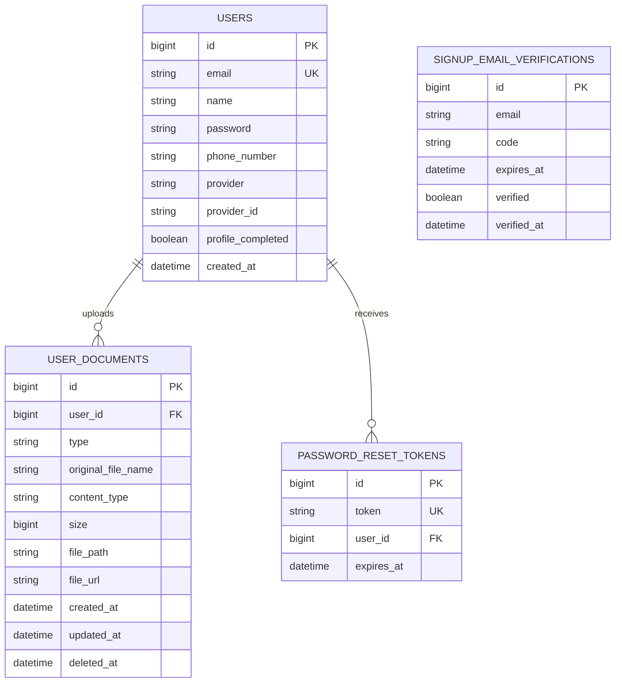
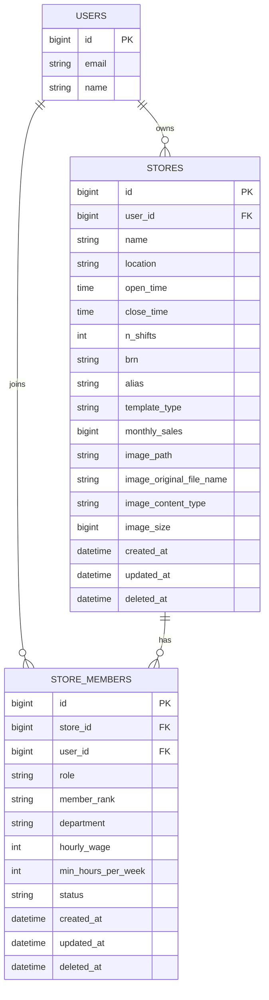
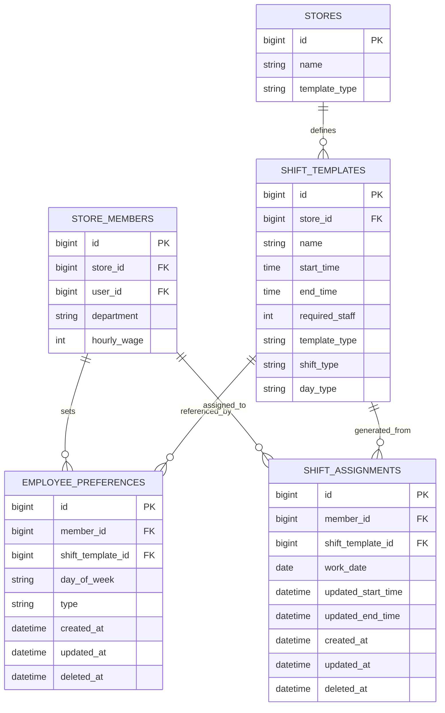
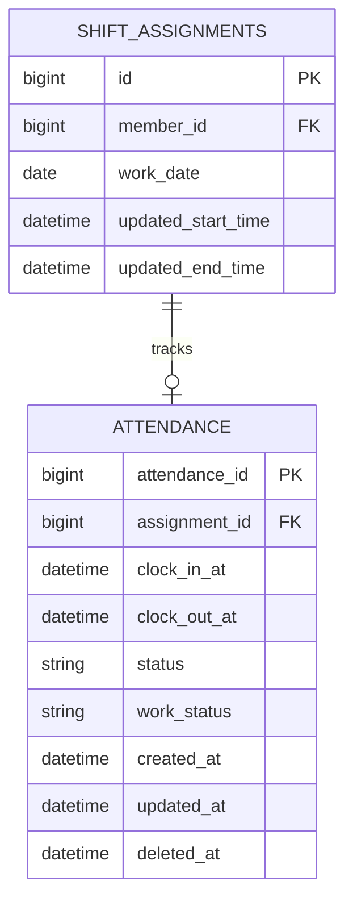
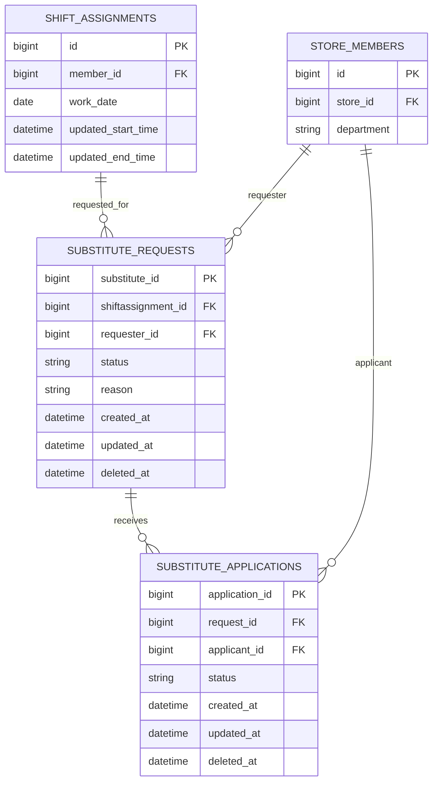
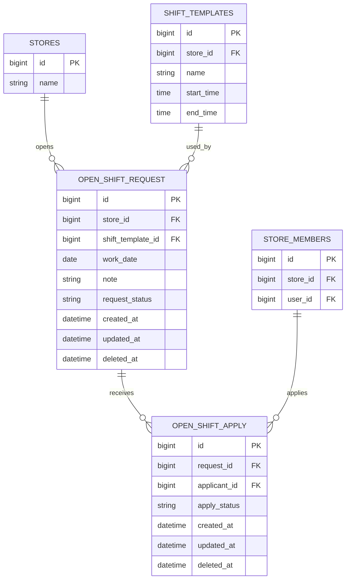

# ShiftMate Domain ERD

도메인별로 분리한 ERD와 컬럼 설명 문서입니다.

- 기준 소스: `src/main/java/com/example/shiftmate/domain/**/entity`
- 컬럼명 전제: Spring Boot 기본 snake_case 네이밍 전략 기준
- 제외 범위: Redis refresh token, 실제 업로드 파일 바이너리, 외부 스토리지 객체

## 공통 컬럼 규칙

| 컬럼 | 설명 |
| --- | --- |
| `created_at` | 데이터 최초 생성 시각 (`BaseCreateEntity`) |
| `updated_at` | 데이터 마지막 수정 시각 (`BaseTimeEntity`) |
| `deleted_at` | 소프트 삭제 시각. `null`이면 활성 데이터 (`BaseTimeEntity`) |

## 1. Auth / User Domain

`signup_email_verifications` 는 회원 생성 이전 단계 데이터라 `users` 와 FK로 연결되지 않고 `email` 값으로만 흐름이 이어집니다.

### USERS

| 컬럼 | 타입 | 설명 | 비고 |
| --- | --- | --- | --- |
| `id` | `bigint` | 사용자 PK | 자동 증가 |
| `email` | `string` | 로그인 및 사용자 식별용 이메일 | 유니크 |
| `name` | `string` | 사용자 이름 | 필수 |
| `password` | `string` | 인코딩된 비밀번호 | 소셜 사용자도 내부 정책상 저장 가능 |
| `phone_number` | `string` | 연락처 | 필수 |
| `provider` | `string` | 로그인 제공자 | `LOCAL`, `KAKAO`, `GOOGLE` |
| `provider_id` | `string` | 소셜 로그인 제공자의 사용자 식별자 | 로컬 계정은 `null` 가능 |
| `profile_completed` | `boolean` | 소셜 가입 후 이름/전화번호 입력 완료 여부 | 기본값 `true` |
| `created_at` | `datetime` | 사용자 생성 시각 | 감사 컬럼 |

### USER_DOCUMENTS

| 컬럼 | 타입 | 설명 | 비고 |
| --- | --- | --- | --- |
| `id` | `bigint` | 사용자 문서 PK | 자동 증가 |
| `user_id` | `bigint` | 문서 소유 사용자 FK | `users.id` 참조 |
| `type` | `string` | 문서 종류 | `HEALTH_CERTIFICATE`, `IDENTIFICATION`, `BANKBOOK_COPY` |
| `original_file_name` | `string` | 업로드 당시 원본 파일명 | 화면 표시/관리용 |
| `content_type` | `string` | MIME 타입 | 예: `image/jpeg`, `application/pdf` |
| `size` | `bigint` | 파일 크기(byte) | 업로드 제한 검증용 |
| `file_path` | `string` | 실제 저장 경로 또는 스토리지 키 | 내부 저장용 |
| `file_url` | `string` | 클라이언트 접근 URL | 미리보기/다운로드용 |
| `created_at` | `datetime` | 문서 생성 시각 | 감사 컬럼 |
| `updated_at` | `datetime` | 문서 수정 시각 | 재업로드 시 갱신 |
| `deleted_at` | `datetime` | 문서 소프트 삭제 시각 | 현재 엔티티 구조상 지원 |

제약:

- `(user_id, type)` 복합 유니크 제약으로 사용자당 문서 타입 1건만 유지합니다.

### PASSWORD_RESET_TOKENS

| 컬럼 | 타입 | 설명 | 비고 |
| --- | --- | --- | --- |
| `id` | `bigint` | 비밀번호 재설정 토큰 PK | 자동 증가 |
| `token` | `string` | 재설정 인증 토큰 | 유니크 |
| `user_id` | `bigint` | 토큰 발급 대상 사용자 FK | `users.id` 참조 |
| `expires_at` | `datetime` | 토큰 만료 시각 | 만료 후 사용 불가 |

### SIGNUP_EMAIL_VERIFICATIONS

| 컬럼 | 타입 | 설명 | 비고 |
| --- | --- | --- | --- |
| `id` | `bigint` | 회원가입 이메일 인증 PK | 자동 증가 |
| `email` | `string` | 인증 대상 이메일 | 회원 생성 전 단계 값 |
| `code` | `string` | 6자리 인증 코드 | 길이 6 |
| `expires_at` | `datetime` | 인증 코드 만료 시각 | 만료 후 인증 불가 |
| `verified` | `boolean` | 인증 완료 여부 | `true` 면 인증 완료 |
| `verified_at` | `datetime` | 인증 완료 시각 | 선택 값 |

## 2. Store / Membership Domain

### STORES

| 컬럼 | 타입 | 설명 | 비고 |
| --- | --- | --- | --- |
| `id` | `bigint` | 매장 PK | 자동 증가 |
| `user_id` | `bigint` | 매장 생성자 또는 소유 사용자 FK | `users.id` 참조 |
| `name` | `string` | 매장명 | 필수 |
| `location` | `string` | 매장 주소 또는 위치 설명 | 선택 |
| `open_time` | `time` | 영업 시작 시각 | 필수 |
| `close_time` | `time` | 영업 종료 시각 | 필수 |
| `n_shifts` | `int` | 하루 시프트 개수 | 필수 |
| `brn` | `string` | 사업자등록번호 | 필수 |
| `alias` | `string` | 매장 별칭 | 선택 |
| `template_type` | `string` | 매장의 현재 템플릿 운영 방식 | `COSTSAVER`, `HIGHSERVICE` |
| `monthly_sales` | `bigint` | 월 매출 | 선택 |
| `image_path` | `string` | 매장 이미지 저장 경로 | 이미지 등록 시 사용 |
| `image_original_file_name` | `string` | 업로드한 원본 이미지명 | 선택 |
| `image_content_type` | `string` | 이미지 MIME 타입 | 선택 |
| `image_size` | `bigint` | 이미지 파일 크기(byte) | 선택 |
| `created_at` | `datetime` | 매장 생성 시각 | 감사 컬럼 |
| `updated_at` | `datetime` | 매장 수정 시각 | 감사 컬럼 |
| `deleted_at` | `datetime` | 매장 소프트 삭제 시각 | 감사 컬럼 |

### STORE_MEMBERS

| 컬럼 | 타입 | 설명 | 비고 |
| --- | --- | --- | --- |
| `id` | `bigint` | 매장 멤버 PK | 자동 증가 |
| `store_id` | `bigint` | 소속 매장 FK | `stores.id` 참조 |
| `user_id` | `bigint` | 실제 사용자 FK | `users.id` 참조 |
| `role` | `string` | 시스템 권한 역할 | `MANAGER`, `STAFF` |
| `member_rank` | `string` | 매장 내 직급 또는 고용 형태 | `MANAGER`, `STAFF`, `PART_TIME` |
| `department` | `string` | 근무 부서 | `HALL`, `KITCHEN` |
| `hourly_wage` | `int` | 시급 | 급여 계산 기준 |
| `min_hours_per_week` | `int` | 최소 주간 근무 시간 | 스케줄 참고값 |
| `status` | `string` | 초대/활성 상태 | `INVITED`, `ACTIVE` |
| `created_at` | `datetime` | 멤버 생성 시각 | 감사 컬럼 |
| `updated_at` | `datetime` | 멤버 수정 시각 | 감사 컬럼 |
| `deleted_at` | `datetime` | 멤버 소프트 삭제 시각 | 감사 컬럼 |

## 3. Shift Planning Domain

### SHIFT_TEMPLATES

| 컬럼 | 타입 | 설명 | 비고 |
| --- | --- | --- | --- |
| `id` | `bigint` | 시프트 템플릿 PK | 자동 증가 |
| `store_id` | `bigint` | 템플릿 소속 매장 FK | `stores.id` 참조 |
| `name` | `string` | 템플릿 이름 | 선택 |
| `start_time` | `time` | 기준 시작 시각 | 필수 |
| `end_time` | `time` | 기준 종료 시각 | 필수 |
| `required_staff` | `int` | 필요 인원 수 | 생성 직후 `null` 가능 |
| `template_type` | `string` | 템플릿 운영 타입 | `COSTSAVER`, `HIGHSERVICE` |
| `shift_type` | `string` | 시프트 성격 | `NORMAL`, `PEAK` |
| `day_type` | `string` | 적용 요일 유형 | `WEEKDAY`, `HOLIDAY` |

### EMPLOYEE_PREFERENCES

| 컬럼 | 타입 | 설명 | 비고 |
| --- | --- | --- | --- |
| `id` | `bigint` | 직원 선호도 PK | 자동 증가 |
| `member_id` | `bigint` | 선호도를 등록한 매장 멤버 FK | `store_members.id` 참조 |
| `shift_template_id` | `bigint` | 선호 대상 시프트 템플릿 FK | `shift_templates.id` 참조 |
| `day_of_week` | `string` | 선호가 적용되는 요일 | `MONDAY` ~ `SUNDAY` |
| `type` | `string` | 선호도 유형 | `UNAVAILABLE`, `NATURAL`, `PREFERRED` |
| `created_at` | `datetime` | 선호도 생성 시각 | 감사 컬럼 |
| `updated_at` | `datetime` | 선호도 수정 시각 | 감사 컬럼 |
| `deleted_at` | `datetime` | 선호도 소프트 삭제 시각 | 감사 컬럼 |

### SHIFT_ASSIGNMENTS

| 컬럼 | 타입 | 설명 | 비고 |
| --- | --- | --- | --- |
| `id` | `bigint` | 실제 배정된 근무 PK | 자동 증가 |
| `member_id` | `bigint` | 배정된 매장 멤버 FK | `store_members.id` 참조 |
| `shift_template_id` | `bigint` | 원본 시프트 템플릿 FK | `shift_templates.id` 참조 |
| `work_date` | `date` | 실제 근무 날짜 | 필수 |
| `updated_start_time` | `datetime` | 확정된 실제 시작 시각 | 템플릿 시간 보정 결과 |
| `updated_end_time` | `datetime` | 확정된 실제 종료 시각 | 자정 넘김 반영 가능 |
| `created_at` | `datetime` | 배정 생성 시각 | 감사 컬럼 |
| `updated_at` | `datetime` | 배정 수정 시각 | 감사 컬럼 |
| `deleted_at` | `datetime` | 배정 소프트 삭제 시각 | 감사 컬럼 |

## 4. Attendance Domain

`shift_assignments` 상세 컬럼 설명은 3절을 참고하면 됩니다.

### ATTENDANCE

| 컬럼 | 타입 | 설명 | 비고 |
| --- | --- | --- | --- |
| `attendance_id` | `bigint` | 출퇴근 기록 PK | 자동 증가 |
| `assignment_id` | `bigint` | 대상 근무 배정 FK | `shift_assignments.id` 참조, 유니크 |
| `clock_in_at` | `datetime` | 실제 출근 시각 | 출근 전에는 `null` 가능 |
| `clock_out_at` | `datetime` | 실제 퇴근 시각 | 퇴근 전에는 `null` 가능 |
| `status` | `string` | 출근 상태 | `NORMAL`, `LATE` |
| `work_status` | `string` | 근무 진행 상태 | `BEFORE_WORK`, `WORKING`, `OFFWORK` |
| `created_at` | `datetime` | 기록 생성 시각 | 감사 컬럼 |
| `updated_at` | `datetime` | 기록 수정 시각 | 감사 컬럼 |
| `deleted_at` | `datetime` | 기록 소프트 삭제 시각 | 감사 컬럼 |

제약:

- `assignment_id` 가 유니크이므로 한 근무 배정에는 출퇴근 기록이 최대 1건만 존재합니다.

## 5. Substitute Domain

`store_members`, `shift_assignments` 상세 컬럼 설명은 2절과 3절을 참고하면 됩니다.

### SUBSTITUTE_REQUESTS

| 컬럼 | 타입 | 설명 | 비고 |
| --- | --- | --- | --- |
| `substitute_id` | `bigint` | 대타 요청 PK | 자동 증가 |
| `shiftassignment_id` | `bigint` | 대타 대상 근무 배정 FK | `shift_assignments.id` 참조 |
| `requester_id` | `bigint` | 대타를 요청한 매장 멤버 FK | `store_members.id` 참조 |
| `status` | `string` | 대타 요청 상태 | `OPEN`, `PENDING`, `APPROVED`, `REQUESTER_CANCELED`, `MANAGER_CANCELED` |
| `reason` | `string` | 대타 요청 사유 | 선택 |
| `created_at` | `datetime` | 요청 생성 시각 | 감사 컬럼 |
| `updated_at` | `datetime` | 요청 수정 시각 | 감사 컬럼 |
| `deleted_at` | `datetime` | 요청 소프트 삭제 시각 | 감사 컬럼 |

### SUBSTITUTE_APPLICATIONS

| 컬럼 | 타입 | 설명 | 비고 |
| --- | --- | --- | --- |
| `application_id` | `bigint` | 대타 지원 PK | 자동 증가 |
| `request_id` | `bigint` | 지원 대상 대타 요청 FK | `substitute_requests.substitute_id` 참조 |
| `applicant_id` | `bigint` | 대타 지원자 멤버 FK | `store_members.id` 참조 |
| `status` | `string` | 대타 지원 상태 | `WAITING`, `SELECTED`, `REJECTED`, `CANCELED` |
| `created_at` | `datetime` | 지원 생성 시각 | 감사 컬럼 |
| `updated_at` | `datetime` | 지원 수정 시각 | 감사 컬럼 |
| `deleted_at` | `datetime` | 지원 소프트 삭제 시각 | 감사 컬럼 |

비즈니스 메모:

- 같은 근무 배정에 대해 동시에 활성 상태(`OPEN`, `PENDING`)의 대타 요청은 서비스 로직으로 1건만 허용합니다.
- 같은 사용자의 중복 지원, 부서 불일치, 시간 겹침은 서비스 로직에서 차단합니다.
- 승인 시 기존 `shift_assignments.member_id` 가 지원자로 변경됩니다.

## 6. Open Shift Domain

`stores`, `shift_templates`, `store_members` 상세 컬럼 설명은 2절과 3절을 참고하면 됩니다.

### OPEN_SHIFT_REQUEST

| 컬럼 | 타입 | 설명 | 비고 |
| --- | --- | --- | --- |
| `id` | `bigint` | 오픈 시프트 요청 PK | 자동 증가 |
| `store_id` | `bigint` | 요청이 열린 매장 FK | `stores.id` 참조 |
| `shift_template_id` | `bigint` | 충원 대상 시프트 템플릿 FK | `shift_templates.id` 참조 |
| `work_date` | `date` | 실제 근무 날짜 | 필수 |
| `note` | `string` | 참고 메모 | 선택 |
| `request_status` | `string` | 오픈 시프트 상태 | `OPEN`, `RECRUITING`, `CLOSED`, `CANCELED` |
| `created_at` | `datetime` | 요청 생성 시각 | 감사 컬럼 |
| `updated_at` | `datetime` | 요청 수정 시각 | 감사 컬럼 |
| `deleted_at` | `datetime` | 요청 소프트 삭제 시각 | 감사 컬럼 |

### OPEN_SHIFT_APPLY

| 컬럼 | 타입 | 설명 | 비고 |
| --- | --- | --- | --- |
| `id` | `bigint` | 오픈 시프트 지원 PK | 자동 증가 |
| `request_id` | `bigint` | 지원 대상 요청 FK | `open_shift_request.id` 참조 |
| `applicant_id` | `bigint` | 지원자 매장 멤버 FK | `store_members.id` 참조 |
| `apply_status` | `string` | 지원 상태 | `WAITING`, `ACCEPTED`, `REJECTED` |
| `created_at` | `datetime` | 지원 생성 시각 | 감사 컬럼 |
| `updated_at` | `datetime` | 지원 수정 시각 | 감사 컬럼 |
| `deleted_at` | `datetime` | 지원 소프트 삭제 시각 | 감사 컬럼 |

비즈니스 메모:

- 첫 지원자가 생기면 요청 상태가 `OPEN` 에서 `RECRUITING` 으로 변경됩니다.
- 승인 시 요청 상태는 `CLOSED` 로 바뀌고, 선택되지 않은 지원은 `REJECTED` 처리됩니다.
- 승인 결과로 새로운 `shift_assignments` 행이 생성되지만, 이를 직접 가리키는 FK 컬럼은 현재 없습니다.

## 빠른 참고 링크

- 통합 상세 ERD: [shiftmate-erd.md](./shiftmate-erd.md)
