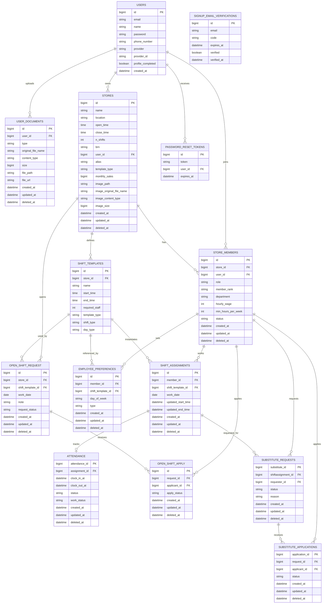

# ShiftMate ERD

This ERD is derived from the current JPA entity model under `src/main/java/com/example/shiftmate/domain/**/entity`.

- Naming assumption: column names follow Spring Boot's default snake_case physical naming strategy.
- Scope: Redis-backed refresh tokens, uploaded files, and external storage objects are intentionally excluded.
- Domain-split ERD with column descriptions: [shiftmate-domain-erd.md](./shiftmate-domain-erd.md)

## Notes

- `users.email` is unique.
- `users(provider, provider_id)` has a composite unique constraint for social login identities.
- `user_documents(user_id, type)` has a composite unique constraint, so each user keeps one document per type.
- `attendance.assignment_id` is unique, which makes `shift_assignments` to `attendance` effectively one-to-zero-or-one.
- Only one active substitute request per assignment is allowed by service logic, but it is not enforced by a database unique constraint.
- Duplicate open-shift and substitute applications are prevented in service logic, not by a database unique constraint.
- Approving an open-shift application creates a new `shift_assignments` row, but there is no direct foreign key from `open_shift_request` or `open_shift_apply` to that new assignment.
