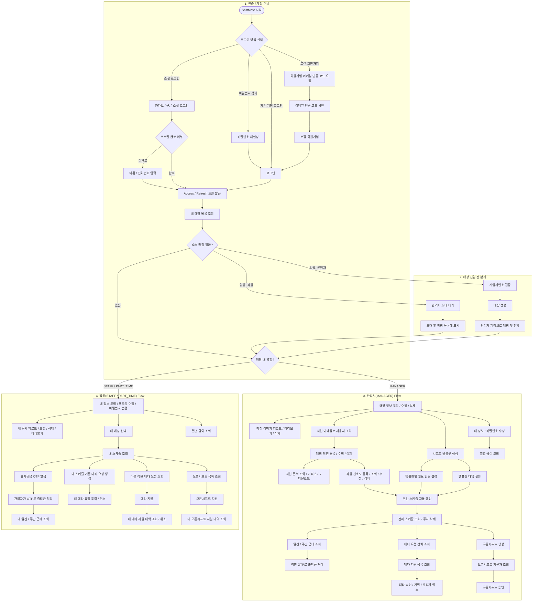

# ShiftMate User Flow Diagram

ShiftMate 백엔드의 현재 컨트롤러/서비스 기준 사용자 흐름을 Mermaid로 정리한 문서입니다.

- 기준 소스: `src/main/java/com/example/shiftmate/domain/**/controller`, `README.md`
- 관점: API 나열이 아니라 실제 사용자 행동 흐름 중심
- 역할 분기: `MANAGER` 와 `STAFF/PART_TIME`

## 흐름 요약

- 공통 진입점은 `로컬 로그인/회원가입`, `소셜 로그인`, `비밀번호 재설정` 입니다.
- 소셜 로그인 사용자는 최초 로그인 후 `프로필 완료(profileCompleted)` 여부에 따라 추가 정보 입력 흐름이 있습니다.
- 매장 소속이 없는 사용자는 운영자라면 `사업자번호 검증 -> 매장 생성`, 직원이라면 `초대 대기` 흐름으로 분기됩니다.
- 관리자 흐름은 `매장 관리 -> 직원 관리 -> 템플릿/선호도 관리 -> 스케줄 생성 -> 근태/대타/오픈시프트 운영` 순서로 연결됩니다.
- 직원 흐름은 `내 정보/문서 관리 -> 스케줄 확인 -> OTP 발급 -> 근태 확인 -> 대타/오픈시프트 참여 -> 급여 조회` 중심입니다.

## 참고

- 전체 ERD: [shiftmate-erd.md](./shiftmate-erd.md)
- 도메인 분리 ERD: [shiftmate-domain-erd.md](./shiftmate-domain-erd.md)
- 시프트 전용 ERD: [shift-planning-erd.md](./shift-planning-erd.md)
